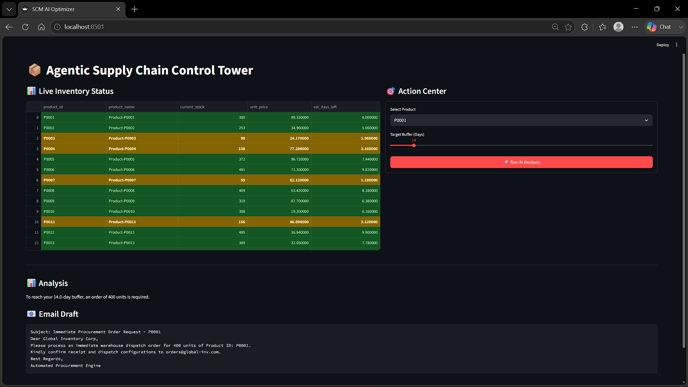

# 📦 Agentic Supply Chain Control Tower & Optimizer

A decoupled, intelligent microservice application that combines predictive data modeling with LLM reasoning agents to monitor inventory runaways, execute supply chain risk forecasting, and automate supplier procurement cycles.

## 🏗️ Architectural Infrastructure Overview

The system is engineered using a clean separation of concerns, isolating the analytical backend endpoints from the user presentation layer:

1. Frontend View Layer (Streamlit): Serves as an interactive interface tracking inventory runaways with live condition styles (Red/Yellow/Green) and houses the action center payload dispatcher.
2. Backend Gateway Layer (FastAPI): Exposes async RESTful endpoints handling core database serialization workflows and request management.
3. Agentic Inference Layer (Agno & Groq): Orchestrates a strict, low-temperature LLM runtime environment running llama-3.3-70b-versatile that performs context lookup operations via automated SQL tool attachments.

## 🛠️ Technology Stack
- Language & Runtime: Python 3.11+
- LLM Agent Framework: Agno (Phidata Core)
- Core Inference Hardware: Groq LPU Cloud Gateway (Llama-3.3-70B)
- Web Application Core: FastAPI & Uvicorn ASGI Server
- Data Architecture: SQLite3 Relational Engine & Pandas Data Processing Matrix
- UI Framework: Streamlit UI

## 🚀 Local Deployment Execution Steps

Ensure you are running inside a virtual environment before installing packages.

### 1. Configure Environmental Key Infrastructure
Create a file named .env directly at your project root directory path and define the following properties:

GROQ_API_KEY = gsk_your_actual_groq_api_token_here
DB_PATH = data/inventory.db

### 2. Ingest Data and Populate the SQLite Database
Run the database initialization script from the root folder:
python src/database.py

### 3. Launch the Backend REST API Service Layer (Terminal 1)
Boot up the FastAPI gateway:
uvicorn main:app --app-dir src --reload --port 8000

### 4. Boot Up the Streamlit Presentation Interface Dashboard (Terminal 2)
Run the interface viewer:
streamlit run src/dashboard.py

Open up your browser workspace pointing to http://localhost:8501 to view your interactive Control Tower interface.