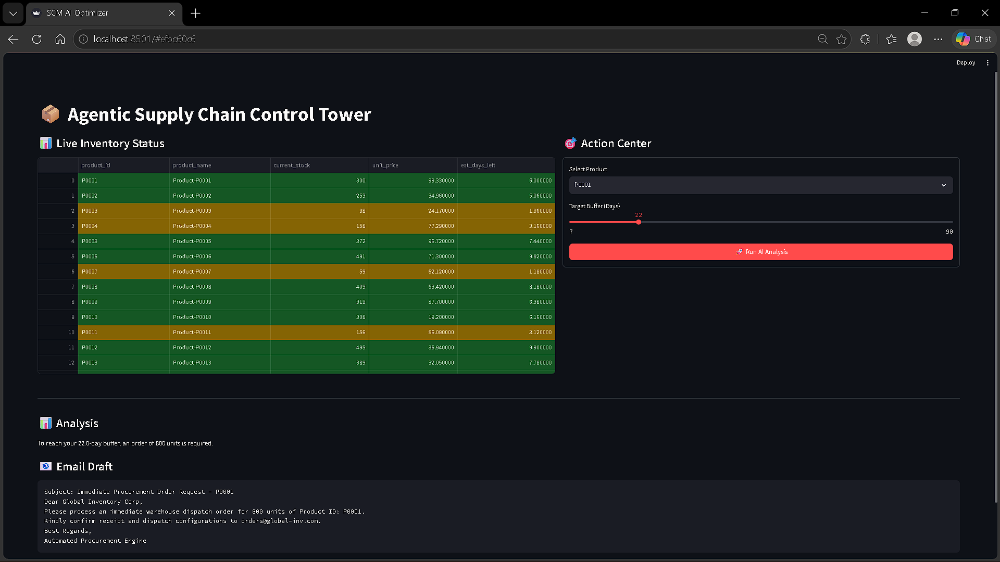

# 📦 Agentic Supply Chain Control Tower & Optimizer

A decoupled, intelligent microservice application that combines predictive data modeling with LLM reasoning agents to monitor inventory runaways, execute supply chain risk forecasting, and automate supplier procurement cycles.

## 🏗️ Architectural Infrastructure Overview

The system is engineered using a clean separation of concerns, isolating the analytical backend endpoints from the user presentation layer:

1. **Frontend View Layer (Streamlit):** Serves as an interactive interface tracking inventory runaways with live condition styles (Red/Yellow/Green) and houses the action center payload dispatcher.
2. **Backend Gateway Layer (FastAPI):** Exposes async RESTful endpoints handling core database serialization workflows and request management.
3. **Agentic Inference Layer (Agno & Groq):** Orchestrates a strict, low-temperature LLM runtime environment running llama-3.3-70b-versatile that performs context lookup operations via automated SQL tool attachments.

## 🛠️ Technology Stack
- Language & Runtime: Python 3.11+
- Container Orchestration: Docker & Docker Compose
- LLM Agent Framework: Agno (Phidata Core)
- Core Inference Hardware: Groq LPU Cloud Gateway (Llama-3.3-70B)
- Web Application Core: FastAPI & Uvicorn ASGI Server
- Data Architecture: SQLite3 Relational Engine & Pandas Data Processing Matrix
- UI Framework: Streamlit UI

## 🚀 Dockerized Deployment Execution Steps

The entire multi-container architecture is orchestrated seamlessly through Docker Compose, isolating environment states and networking bridges automatically.

### 1. Configure Environmental Key Infrastructure
Create a file named `.env` directly at your project root directory path and define your Groq authentication credentials:

GROQ_API_KEY = gsk_your_actual_groq_api_token_here
DB_PATH = data/inventory.db

### 2. Build and Launch the Container Stack
To automatically trigger the multi-stage image compilation, build your backend/frontend services, and establish the internal container network bridge, run:
docker-compose up --build

### 3. Access the Application Services
Once the startup sequences stabilize and the FastAPI backend confirms database availability, open your browser workspace:
* **Interactive Control Tower Dashboard:** http://localhost:8501
* **Backend REST API Interactive Docs:** http://localhost:8000/docs

### 4. Tear Down the Environment Safely
To safely spin down the active microservice containers and clear out isolated virtual memory allocations:
docker-compose down -v